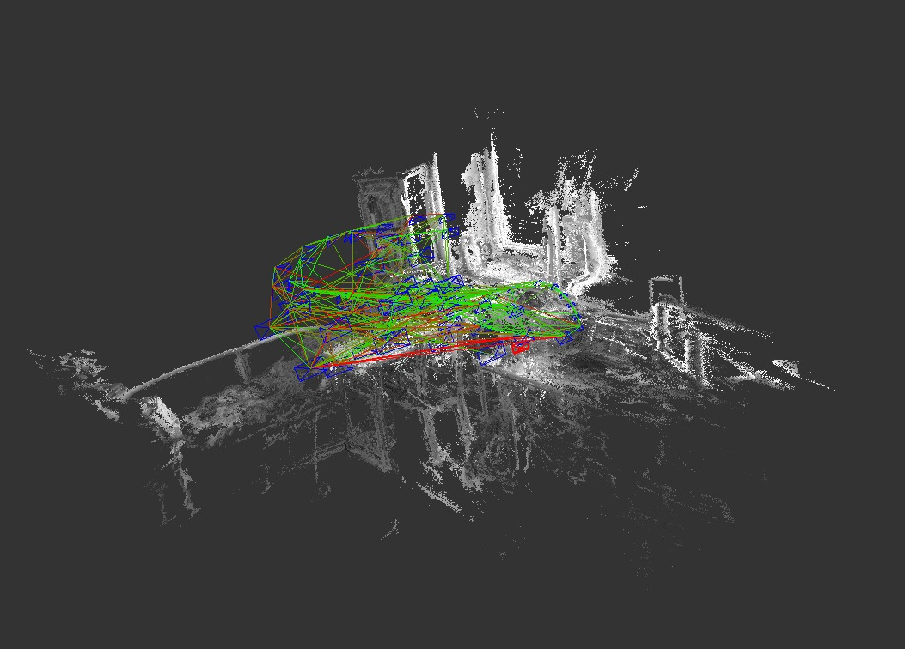

# lsd_slam_cg

Modified version of [tum-vision/lsd_slam](https://github.com/tum-vision/lsd_slam) (commit d1e6f0e on Dec 12, 2014)

**LSD-SLAM (Large-Scale Direct Monocular SLAM)** is a novel approach to real-time monocular SLAM. It is fully direct (i.e. does not use keypoints / features) and creates large-scale, semi-dense maps in real-time on a laptop.

Papers:
  - *LSD-SLAM: Large-Scale Direct Monocular SLAM, J. Engel, T. Schöps, D. Cremers*, ECCV '14
  - *Semi-Dense Visual Odometry for a Monocular Camera, J. Engel, J. Sturm, D. Cremers*, ICCV '13

Link:
  - http://vision.in.tum.de/lsdslam

-----

# Install & Build

```sh
sudo apt install libsuitesparse-dev libqglviewer-dev-qt4 ros-kinetic-libg2o
sudo ln -s /usr/lib/x86_64-linux-gnu/libQGLViewer-qt4.so \
           /usr/lib/x86_64-linux-gnu/libQGLViewer.so  

mkdir -p ws_lsd_slam/src & cd ws_lsd_slam/src
git clone https://github.com/cggos/lsd_slam_cg.git
cd ..
catkin_make -j2
```

# Run

* run with  [Room Example Sequence](http://vmcremers8.informatik.tu-muenchen.de/lsd/LSD_room.bag.zip)

	```sh
	rosrun lsd_slam_viewer viewer
	rosrun lsd_slam_core live_slam image:=/image_raw camera_info:=/camera_info
	rosbag play ~/LSD_room.bag
	```

  <div align=center>
    
  </div>

# Loop-Closure

## openFabMap for large loop-closure detection

If you want to use openFABMAP for large loop closure detection, uncomment the following lines in `lsd_slam_core/CMakeLists.txt` :

    #add_subdirectory(${PROJECT_SOURCE_DIR}/thirdparty/openFabMap)
    #include_directories(${PROJECT_SOURCE_DIR}/thirdparty/openFabMap/include)
    #add_definitions("-DHAVE_FABMAP")
    #set(FABMAP_LIB openFABMAP )

**Note for Ubuntu 14.04:** The packaged OpenCV for Ubuntu 14.04 does not include the nonfree module, which is required for openFabMap (which requires SURF features).
You need to get a full version of OpenCV with nonfree module, which is easiest by compiling your own version.
We suggest to use the [2.4.8](https://github.com/Itseez/opencv/releases/tag/2.4.8) version, to assure compatibility with the current indigo open-cv package.


# Troubleshoot / FAQ

**How can I get the live-pointcloud in ROS to use with RVIZ?**

You cannot, at least not on-line and in real-time. The reason is the following:

In the background, LSD-SLAM continuously optimizes the pose-graph, i.e., the poses of all keyframes. Each time a keyframe's pose changes (which happens all the time, if only by a little bit), all points from this keyframe change their 3D position with it. Hence, you would have to continuously re-publish and re-compute the whole pointcloud (at 100k points per keyframe and up to 1000 keyframes for the longer sequences, that's 100 million points, i.e., ~1.6GB), which would crush real-time performance.

Instead, this is solved in LSD-SLAM by publishing keyframes and their poses separately:
- keyframeGraphMsg contains the updated pose of each keyframe, nothing else.
- keyframeMsg contains one frame with it's pose, and - if it is a keyframe - it's points in the form of a depth map.

Points are then always kept in their keyframe's coodinate system: That way, a keyframe's pose can be changed without even touching the points. In fact, in the viewer, the points in the keyframe's coodinate frame are moved to a GLBuffer immediately and never touched again - the only thing that changes is the pushed modelViewMatrix before rendering.

Note that "pose" always refers to a Sim3 pose (7DoF, including scale) - which ROS doesn't even have a message type for.

If you need some other way in which the map is published (e.g. publish the whole pointcloud as ROS standard message as a service), the easiest is to implement your own Output3DWrapper.


**Tracking immediately diverges / I keep getting "TRACKING LOST for frame 34 (0.00% good Points, which is -nan% of available points, DIVERGED)!"**
- double-check your camera calibration.
- try more translational movement and less roational movement
